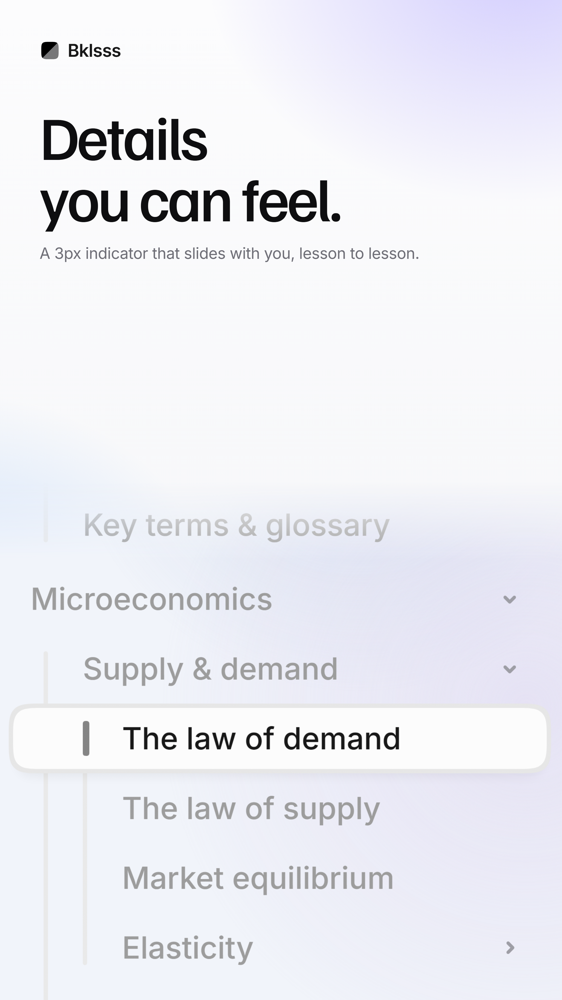

# Selected — designs worth repeating

Keepers live here. Each one has its numbers written down so it can be rebuilt
for any other screen, not just the one it was made from.

---

## macro-crop-bleed



Same image as `social/03-detail.png`. A tiny piece of UI, blown up until it
fills the bottom of the frame, dissolving in under the headline.

**Why it works:** it shows one detail instead of a whole screen, so there is
nothing to read and nothing to decode — the eye lands on the headline, then on
the one row that is lit up. The bleed off the bottom implies the rest of the
product without having to show it.

### The numbers

**Source crop** — the whole trick is capturing small and printing large.

| | |
| --- | --- |
| Crop size | 258 × 238 CSS px (one active row plus ~3 rows of context) |
| Capture DPR | **6** — on a small viewport (900 × 800) so the buffer stays sane |
| Result | ~1548 × 1428 real px, enlarged ~4× on the poster and still sharp |
| Crop edges | land on row boundaries — never slice a row or a word in half |

Capturing at DPR 2 and enlarging looks soft. This is the part to not skip.

**Canvas** — 1080 × 1920 at deviceScaleFactor 2 → 2160 × 3840 output.

**Type**

| | |
| --- | --- |
| Headline | Familjen Grotesk 500, **118px**, line-height 1.0, tracking −0.04em, `#0D0D0F` |
| Sub | Inter 400, 30px, line-height 1.44, tracking −0.012em, `#6A6A72` |
| Both | left-aligned at 76px padding, two lines max |

Short headline, big size. It only holds at 118px because it is 2–3 words a line.

**Image placement**

```css
.bleed{ position:absolute; left:0; right:0; top:924px; bottom:0; overflow:hidden;
        mask-image:linear-gradient(to bottom, transparent 0, #000 150px); }
.bleed img{ width:1080px; left:0; top:0; }   /* full-bleed, runs off the bottom */
```

The 150px mask fade is what stops it looking like a pasted-in screenshot — the
UI emerges from the background instead of sitting on it. Height is sized so the
image runs *past* 1920 and gets cut by the frame, never landing short.

**Background** — the app's own colour cast, pushed a little.

```css
radial-gradient(1000px 780px at 92% -4%,  rgba(139,124,255,.38), transparent 60%)  /* lavender */
radial-gradient(820px 700px at -8% 62%,   rgba(96,166,255,.30),  transparent 62%)  /* blue     */
radial-gradient(760px 560px at 62% 106%,  rgba(255,176,124,.22), transparent 60%)  /* warm     */
linear-gradient(#FCFCFD, #F3F4F7)                                                  /* base     */
```

Plus grain over the top: SVG `feTurbulence` baseFrequency 0.85, 3 octaves,
opacity 0.30, `mix-blend-mode: overlay`. Without it the gradients band into
visible stripes once a platform re-compresses the upload.

### Reusing it on another screen

In `_scripts/1-capture.mjs`, point the detail block at a different element and
keep the DPR at 6. In `_scripts/2-posters.mjs`, the `03-detail` entry is the
whole layout — swap the two strings and the crop, leave the geometry alone.

Good candidates: the command palette, the "On this page" TOC with its scroll-spy
bar, a code playground mid-run, the top-bar breadcrumb.
